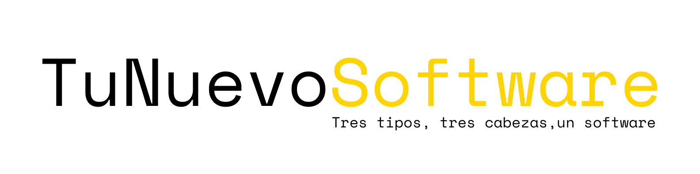

## Visión general

TuNuevoSoftware es un estudio digital enfocado en crear productos con personalidad, arquitectura sólida y diseño que marca la diferencia. No somos una fábrica de código: somos un equipo pequeño que piensa “raro” y construye software minimalista con impacto máximo.

**Fundadores:** Arkaitz, Álvaro y Gonzalo.

---

## Qué hacemos

- Desarrollo de **SaaS B2B** escalables  
- Implementación de **e-commerce** de alto rendimiento  
- Creación de **apps móviles / PWAs**  
- Lanzamiento de MVPs desde cero para **startups**  

Cada proyecto lleva nuestra “firma digital”: estética cuidada, interfaces pulidas y stack tecnológico moderno.

---

## Equipo & roles

| Nombre | Rol | Enfoque técnico |
|---|---|---|
| Arkaitz L. | Backend & Arquitectura | APIs robustas, escalabilidad. Node.js, Java, React, PostgreSQL |
| Álvaro Q. | Producto / Fullstack | De principio a fin: Next.js, React, diseño de producto |
| Gonzalo Azaldegi | Frontend / UI | Experiencias memorables con React, Astro, Tailwind, Figma |

---

## Stack principal

- **Frontend:** React, Next.js, Astro, Tailwind CSS  
- **Backend:** Node.js, Python  
- **Base de datos:** PostgreSQL  
- **Infraestructura:** Docker, AWS  
- **APIs:** REST (y potencial para GraphQL)  
- **Diseño & prototipado:** Figma  
- **Versionado y CI/CD:** Git, pipelines automatizadas  
- **Deploy y hosting:** Vercel  

---

## Proyectos destacados

- **Soft/Where** (2024, experimental): explora identidad digital.  
- **Minimal CMS** (2024, producción): sistema de gestión sencillo y elegante.  
- **Async Tools** (2025, beta): herramientas para equipos remotos que trabajan de forma asincrónica.  

Cada caso tiene su historia, tecnología escogida y decisiones de diseño que comunican quiénes somos.

---

## Principios de trabajo

- No usamos plantillas ni soluciones genéricas: construimos lo que el proyecto necesita.  
- Iteración rápida con entregas reales.  
- Comunicación clara y directa (sin jerga innecesaria).  
- Responsabilidad compartida: tu proyecto es tan nuestro como tuyo.  
- Calidad sobre cantidad: mejor hacer pocas cosas bien que muchas mediocres.

---

## Cómo colaborar

1. Cuéntanos tu idea: alcance, objetivos, retos.  
2. Hacemos una propuesta: alcance, tiempos, inversión.  
3. Fases del proyecto: definición, diseño, desarrollo, entrega, mantenimiento.  
4. Feedback constante: estás dentro del ciclo.  
5. Lanzamiento y acompañamiento post-lanzamiento.

---

## Contacto

Si quieres construir algo que no se parezca a nada, conversemos.

Reserva [aquí con nosotros](https://tunuevosoftware.com/reservas) o [visita nuestra web](https://tunuevosoftware.com/) para más información.  
